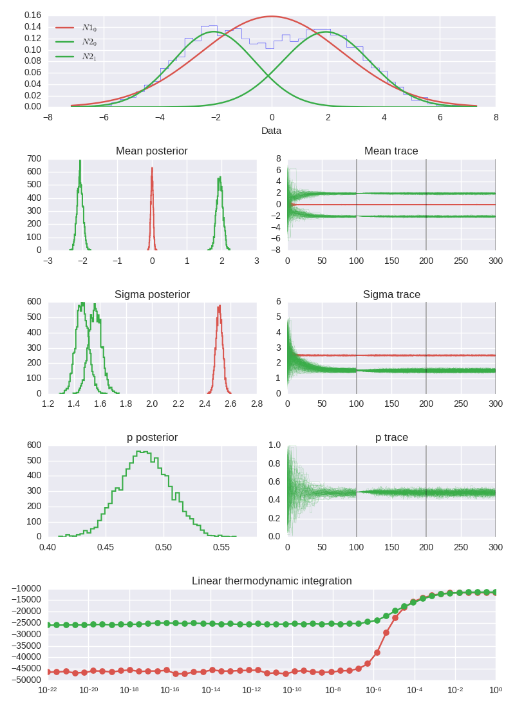

# Bayes Bimodal Test

This is a simple implementation of a Bayesian model comparison for bimodality.
In typical usage, we have a 1D set of data points `data`, then the test can be
run with a single call to `BayesBimodalTest`. This fits a unimodal and bimodal
Gaussian to the data, computes the unnormalised evidence for both and print
the so-called Bayes factor [Bayes Factor](https://en.wikipedia.org/wiki/Bayes_factor)
between the two models.

## Example

This is the code contained in the simple `test.py` example

``` python
import BayesBimodalTest as BBT
import numpy as np

N = 5000
dataA = np.random.normal(2, 1.5, N/2)
dataB = np.random.normal(-2, 1.5, N/2)
data = np.concatenate([dataA, dataB])
test = BBT.BayesBimodalTest(data, nburn0=100, nburn=100, nprod=100, ntemps=50)
test.diagnostic_plot()
test.BayesFactor()
```

Running this code will output a log10 Bayes factor, in this case of `68.1 +/- 5.0` giving
strong evidence in support of the Bimodal model. It will also produce a
diagnostic plot which we show below. In the top panel is the
original raw data along with the fitted underlying distributions, then 6 panels
gives the posterior and traces of the mean, std. dev., and the weight (only of
the bimodal mixture model). Finally there are two plots of the therodynamic
integration used to calculate the evidence.



## Details

* We use the [parallel tempered emcee sampler (PTSampler)](http://dan.iel.fm/emcee/current/user/pt/)  to perform MCMC parameter estimation.

* The PTSampler convieniently has in-built thermodynamic integration to estimate the
  the evidence and error of that evidence. For more information see the implementation
  notes of the PTSampler

* The methodology for the MCMC chains is a three step process as follows.

  > Define uniform priors for the mean by `[min(data), max(data]`, for the
    std. dev. by `[0, 2std(data)]`, and for the weight of the bimodal mixture
     model as `[0, 1]`.

  > Initialise
  the MCMC chains picking randomly from these priors, run for `nburn0` steps.

  > Select the chain with the largest probability and reinitialise all the chains
  in a small spread about this point. Run the chains for `nburn` and discard,
  run the chains for `nprod` and use to estimate the posterior and evidence.

  This `nburn0` run here removes the chains which stuck. It is not always neccersery,
  and if the posteriors are multimodal can infact distort the inference, so the
  chains should always be checked.


